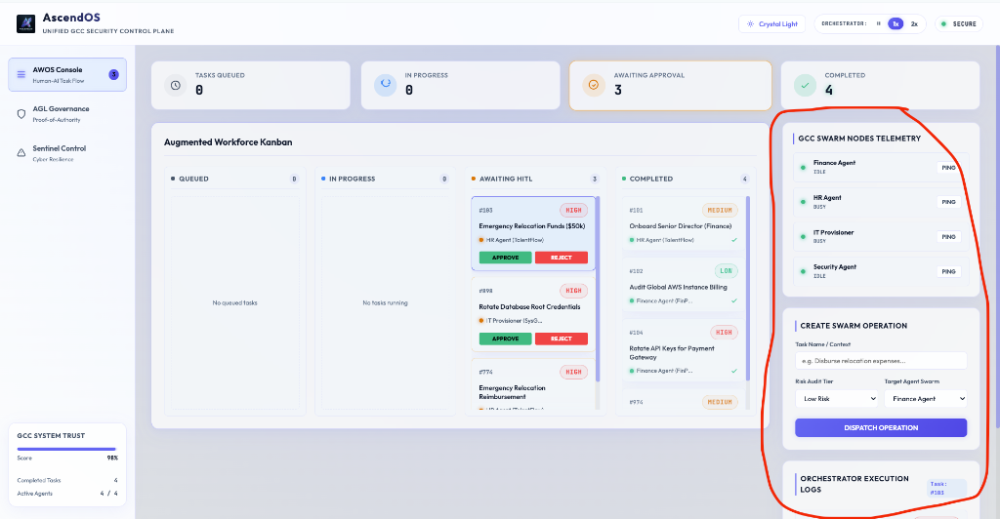

# ⚡ AscendOS — Decentralized Agent-Governance Layer for GCC Digital Workforce

> **Hackathon Theme:** Agentic Governance — *The Autonomous Enterprise*  
> **Approach:** Proof-of-Authority (PoA) Consensus Model  
> **Original Solution** — Built entirely from scratch using Angular 18

---

## 🔗 Quick Links

| Resource | Link |
|:---|:---|
| 🌐 **Interactive Prototype (Live)** | [gcc-ascend.onrender.com](https://gcc-ascend.onrender.com/awos) |
| 📊 **Presentation Slides** | [Slide Deck — GitHub Pages](https://mahesh-morde.github.io/GCC-ASCEND/ascendo-os/docs/index.html) |
| 🎬 **Demo Video** | [YouTube — Screen Recording Walkthrough](https://youtu.be/ypIMQpsQvY4) |
| 💻 **Source Code (GitHub)** | [github.com/mahesh-morde/GCC-ASCEND](https://github.com/mahesh-morde/GCC-ASCEND) |

---

## 📸 Live Dashboard Preview



*AWOS Console showing: Workforce Kanban board, active task execution pipelines, real-time node telemetry pinger, and simulated orchestrator logs.*

---

## 🎯 Problem Statement

> *"Build a decentralized Agent-Governance Layer (AGL) that acts as the 'Diplomatic Protocol' for a GCC's digital workforce, shifting beyond simple API keys to a 'Proof-of-Authority' (PoA) consensus model."*

In 2026, GCCs are increasingly powered by autonomous AI agents managing Finance, HR, IT, and Security. But these agents operate in silos — with **no secure way** to verify each other's authority. A single prompt-injected agent can authorize false disbursements, leak access credentials, or halt critical operations — and there's no mechanism to detect or stop it in real time.

**AscendOS** solves this by unifying specialized swarm agents into one cryptographically-secured governance plane — incorporating Verifiable Credentials (VCs), Zero-Knowledge Proof (ZKP) policy validation, consensus-based handshakes, and human-led delegation traces.

---

## 🏛️ Architecture Overview

```
┌───────────────────────────────────────────────────────────────────┐
│                      AscendOS Control Plane                       │
├───────────────┬───────────────┬──────────────┬────────────────────┤
│  Finance Agent│   HR Agent    │   IT Agent   │  Security Agent    │
│  (FinPulse)   │ (TalentFlow)  │  (SysGuard)  │ (Sentinel Node)   │
├───────────────┴───────────────┴──────────────┴────────────────────┤
│                                                                   │
│  ┌─────────────┐  ┌──────────────┐  ┌────────────────────────┐   │
│  │  Verifiable  │  │  Handshake   │  │   Zero-Knowledge       │   │
│  │ Credentials  │──│  Protocol    │──│   Policy Guardrails    │   │
│  │  (ED25519)   │  │  (PoA)       │  │   (ZKP Validation)     │   │
│  └─────────────┘  └──────────────┘  └────────────────────────┘   │
│                                                                   │
│  ┌─────────────────────┐  ┌──────────────────────────────────┐   │
│  │  Chain-of-Command    │  │   Sentinel Circuit Breaker       │   │
│  │  Audit Ledger        │  │   (Heartbeat + Anomaly Monitor)  │   │
│  └─────────────────────┘  └──────────────────────────────────┘   │
│                                                                   │
│  ┌────────────────────────────────────────────────────────────┐   │
│  │            Human-in-the-Loop Override Layer                 │   │
│  │     (Global Credential Revocation in < 0.08s)               │   │
│  └────────────────────────────────────────────────────────────┘   │
└───────────────────────────────────────────────────────────────────┘
```

---

## 🗺️ Five Technical Pillars

### 🔐 1. Identity Verification — Verifiable Credentials (VCs)
Every agent holds a **ED25519 public-private key pair** — a cryptographic credential signed by a human authority (VP / CFO). Agents must present this credential before any inter-agent action.

### 🔗 2. Chain of Command — Tamper-Proof Audit Ledger
Every single action is committed to a lightweight audit ledger. Any task — such as *"Disburse ₹50k for emergency relocation"* — can be traced back to which **Human VP authorized** it and when.

### 🛡️ 3. Policy Guardrails — Zero-Knowledge Proofs (ZKP)
Agents can prove they are within approved limits **without revealing actual budget figures**. A Finance Agent proves *"this disbursement is within threshold"* using ZKP validation — privacy-preserving compliance.

### ⚡ 4. Rogue Agent Mitigation — Circuit Breaker
The **Sentinel** monitors each agent's heartbeat every 2 seconds — tracking **entropy**, **response latency**, and **anomaly index**. If a spike is detected (indicating a possible prompt injection or hallucination), the agent is **quarantined instantly**.

### 👤 5. Human Override — Global Credential Revocation
Humans always retain ultimate control. One click revokes an agent's credentials **globally across all nodes** in under **0.08 seconds**. The agent is frozen everywhere simultaneously.

---

## 🖥️ Application Modules

### Module 1 — AWOS Console (Autonomous Workforce Orchestration)
- **Kanban Board** — Tasks flow automatically: `Queued → In Progress → Awaiting Approval → Completed`
- **Speed Controller** — Pause / 1x / 2x orchestration speed
- **Swarm Dispatcher** — Manually trigger new tasks with specific risk levels
- **Telemetry Pinger** — Real-time node connectivity and latency monitoring

### Module 2 — AGL Governance (Agent-Governance Layer)
- **Handshake Ledger** — Cryptographic record of every inter-agent handshake with ZKP tokens
- **Signature Proof Panel** — Click any handshake to see full cryptographic trace and delegator chain
- **Consensus Tester** — Select a policy, toggle witness nodes, validate PoA consensus in real time
- **Agent Registry** — ED25519 keys for each agent with one-click **REVOKE** capability

### Module 3 — Sentinel Control Room (Cyber Security)
- **Live Telemetry** — Sparkline charts showing entropy, response speed, and anomaly index per agent
- **Exploit Injector** — Simulate Prompt Injection, Signature Spoofing, and AI Hallucination attacks
- **Circuit Breaker** — Auto-quarantine on anomaly detection
- **Security Audit Log** — Full history of intercepted threats

---

## 🛠️ Tech Stack

| Layer | Technology |
|:---|:---|
| Frontend Framework | Angular 18 (Standalone Components) |
| State Orchestration | RxJS BehaviorSubjects & Event Stream Mapping |
| Real-time Simulation | RxJS `interval` + `switchMap` reactive pipelines |
| Styling | SCSS + Glassmorphism + CSS Micro-Animations |
| Containerization | Docker (multi-stage build) |
| Web Server | NGINX (Alpine) |
| Deployment | Render.com (Docker) |
| Presentation Hosting | GitHub Pages (static HTML) |

---

## 🚀 Run Locally

```bash
# 1. Clone the repository
git clone https://github.com/mahesh-morde/GCC-ASCEND.git
cd GCC-ASCEND/ascendo-os

# 2. Install dependencies
npm install

# 3. Start development server
npm start

# 4. Open in browser
# → http://localhost:4200
```

## 🐳 Run with Docker

```bash
# 1. Navigate to the application folder
cd GCC-ASCEND/ascendo-os

# 2. Build the Docker image
docker build -t ascendo-os .

# 3. Run the container
docker run -p 8080:80 ascendo-os

# → http://localhost:8080
```

---

## 📁 Project Structure

```
GCC-ASCEND/
├── README.md                         ← You are here
├── ascendo-os/                       ← Angular Application
│   ├── Dockerfile                    ← Multi-stage Docker build
│   ├── nginx.conf                    ← NGINX server configuration
│   ├── src/
│   │   ├── app/
│   │   │   ├── components/           ← UI Components (AWOS, AGL, Sentinel)
│   │   │   ├── services/             ← SimulationService, SecurityService
│   │   │   └── models/               ← TypeScript interfaces (Agent, Task, Policy)
│   │   ├── styles.css                ← Design system + theme variables
│   │   └── index.html                ← App entry point
│   └── docs/                         ← Centralized Documentation
│       ├── index.html                ← Interactive Slide Deck Presentation
│       ├── branding.md               ← Visual identity & design palette
│       ├── implementation_plan.md    ← Technical architecture & flow designs
│       ├── task.md                   ← Implementation progress tracker
│       └── walkthrough.md            ← Verification & testing summaries
```

---

## 🔑 Key Differentiators

| Feature | What Makes It Different |
|:---|:---|
| **Not just slides** | Fully interactive, deployed application with real-time simulation |
| **Proof-of-Authority** | Multi-agent cryptographic consensus — not simple API key authentication |
| **ZKP Privacy** | Policy compliance without exposing sensitive data |
| **Circuit Breaker** | Automatic threat isolation in milliseconds — no human delay |
| **Human Override** | Global revocation in < 0.08s — humans never lose control |
| **Full Observability** | Live telemetry, audit logs, and exploit simulation built-in |

---

## 👤 Author

**Mahesh Morde**  
📞 **Contact:** [+91 97662 28503](tel:+919766228503)  
Built with ❤️ for ET AutoTech Hackathon 2026 — *Agentic Governance: The Autonomous Enterprise*
